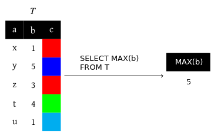

<u>Objectif :</u> 

Centraliser toutes les données à un unique endroit, la base de données, qui possède son propre système de gestion, un SGBD, avec un unique langage pour interagir avec les données, le SQL.

## I. Conception d'une base de données

### 1. Paradigme logique

Une base de données est un ensemble de données, d’informations en rapport les unes avec les autres, stockés sur un support informatique avec lequel différents utilisateurs interagissent. Ces interactions se font avec des requêtes.

Le SGBD (système de gestion de bases de données) est un logiciel permettant de simplifier la gestion de la base pour l’utilisateur.

<u>Missions du SGBD :</u>

- Choisir les structures de données les plus pertinentes et efficaces pour stocker toutes les données.

- Garantir l’efficacité maximale possible pour toutes les opérations sur la base (lecture, écriture, modification …).

- Garantir la maintenance des données.

- Gérer des utilisateurs (droits, …)

- Gérer les accès concurrents.

- Réceptionner et traiter les requêtes en respectant les principes ACID 
	
	- Atomicité : “Toute la requête ou rien”.
	
	- Cohérence : “Respect des contraintes”.
	
	- Isolation : “Traitement d’une requête comme si c’était la seule”.
	
	- Durabilité : “Les requêtes sont permanentes“.

<u>Définition :</u>

Le paradigme logique est un paradigme de programmation qui définit un programme comme une suite de propriétés que doit respecter le résultat, sans aucune indication sur la manière dont ce résultat va être calculé.

### 2. Modèle entité-association

→ Représentation graphique des données qu’on souhaite stocker et des liens entre ces ces données.

<u>Définition :</u>

Une entité est un objet (au sens large) du monde réel. Les informations liées à cet objet sont appelées ses propriétés. 

Une entité doit toujours pouvoir être identifiée de manière unique. Parmi ses propriétés, une ou plusieurs la distingue des autres entités.

Un type d’entité regroupe toutes les entités ayant le même type de propriétés.

<u>Représentation graphique d’un type d’entité :</u>

![[Excalidraw/Drawing 2024-05-29 10.43.53.excalidraw]]

<u>Définition :</u>

Une association représente un lien entre plusieurs entités. Les associations peuvent avoir des propriétés.

Un type d’association regroupe les associations qui ont des propriétés de type similaires, et qui font le lien entre des entités appartenant au même type d’entité.

<u>Exemple :</u> 

![[Excalidraw/Drawing 2024-05-29 10.51.04.excalidraw]]

On se limitera aux associations binaires (2 entités).

![[Excalidraw/Drawing 2024-05-29 10.55.12.excalidraw]]

<u>Cardinalité :</u>

Une contrainte de cardinalité d’une entité $E$ participant à une association $A$ est (min-max) avec min le nombre minimal de fois où $E$ participe à $A$ et max le nombre maximal où $E$ participe à $A$.

La cardinalité d’une association reliant 2 entités de contraintes respectives $(\min_{1}-\max_{1})$ et $(\min_{2}-\max_{2})$  est $\max_{1} - \max_{2}$.

<u>Exemple :</u>

![[Excalidraw/Drawing 2024-05-29 11.06.09.excalidraw]]

<u>Cardinalités usuelles :</u>

- $1-1$ (one to one)

- $1-*$ (one to many)

- $*-*$ (many to many)

<u>Exemple :</u>

![[Excalidraw/Drawing 2024-05-29 11.13.02.excalidraw]]

Si on a dans le modèle entité-association des associations de cardinalités $*-*$, on doit avant de concevoir la base les transformer en deux associations de cardinalité $1-*$.

<u>Exemple :</u>

![[Excalidraw/Drawing 2024-05-29 11.17.50.excalidraw]]

### 3. Modèle relationnel

= Organisation concrète des données dans la base 

= interface avec l’utilisateur

Dans le modèle relationnel, une base de données est vue comme un ensemble de relations. Une relation (“table”) est un tableau à deux dimensions stockant des informations relatives à un même sujet. Ces informations correspondent aux colonnes de la relation, ils sont appelées attributs.

<u>Définition :</u>

Le domaine d’un attribut est l’ensemble des valeurs que peut prendre cet attribut.

(type + contraintes supplémentaires)

- chaines de caractères (TEXT)

- entiers (INTEGER)

- réels (REAL)

<u>Schéma relationnel :</u>

Relation $R$ à $n$ attributs $A_{1},…,A_{n}$ de domaines respectifs $D_{1},…,D_{n}$ 

$R(A_{1}:D_{1},…,A_{n}:D_{n})$

<u>Définition :</u>

Les lignes d’une relation $R$ correspondant à des données, sont appelés enregistrements.

<u>Clé primaire :</u>

Chaque enregistrement d’une relation doit être unique, une clé primaire permet de faire respecter cette contrainte d’unicité.

Une clé primaire est un attribut ou ensemble d’attributs pour lequel la valeur de chaque enregistrement est distincte. On la souligne dans le schéma relationnel.

<u>Exemple :</u>

$R(\underline{A_{1}}:D_{1},A_{2}:D_{2}, \underline{A_{3}}:D_{3},A_{4}:D_{4},…)$

La clé première de $R$ est $(A_{1},A_{3})$. On choisit toujours le nombre minimum d’attributs possibles.

<u>Clés étrangères :</u>

Une clé étrangère d’une relation $R_{1}$ est un attribut ou ensemble d’attributs qui constituent la clé primaire d’une autre relation $R_{2}$. On dit que la clé étrangère de $R_{1}$ fait référence à $R_{2}$. Les clés étrangères font respecter la contrainte d’intégrité.

<u>Schéma relationnel complet :</u>

<u>Exemple :</u>

$R_{1}(\underline{A_{1,1}}:D_{1,1},A_{1,2}:D_{1,2},…)$

$R_{2}(\underline{A_{2,1}}:D_{2,1} \rightarrow A_{2,2}:D_{2,2},…)$

$…$

<u>Conception d’une base de données = déterminer un schéma relationnel complet</u>

- Dessiner le modèle $E-A$

- Transformer les cardinalités $*-*$ en deux $1-*$

- Dans le schéma relationnel

entité $\rightarrow$ relation

association $1-1 \rightarrow$ fusionne relation

association $1-* \rightarrow$ clé étrangère (dans “$1$ faisant référence à $*$)

<u>Exemple :</u>

Passage du modèle entité-association au modèle relationnel.

![[Excalidraw/Drawing 2024-05-30 08.04.14.excalidraw]]

<u>Schéma relationnel complet :</u>

Auteurs($\underline{id}$ : INT, prénom : TEXT, nom : TEXT, naissance : TEXT, mort : TEXT, ville_naissance $\rightarrow$ Villes.id INTEGRER) 

Villes($\underline{id}$ : INT, nom : TEXT) 

Bibliothèques($\underline{id}$ : INT, nom : TEXT, adresse : TEXT, code postal : INT, ville $\rightarrow$ Villes.id : INTEGRER) 

Livres($\underline{isbn}$ : TEXT, titre : TEXT, année : INT, image : TEXT, auteur $\rightarrow$ Auteurs.id :INTEGRER) 

Inventaire($\underline{biblio} \rightarrow$ Bibliothèques.id : INTEGRER, $\underline{livre} \rightarrow$ Livres.isbn : TEXT, nb_exemplaire : INTEGRER)

## II. Requêtes SQL

SQL signifie Structured Query Language.

<u>Quelques règles :</u>

- MOTS-CLES en majuscule

- Relations en minuscule sauf l’initiale

- Attributs en minuscule

- retours à la ligne fréquents (chaque mot-clé)

- éviter accents, caractères spéciaux

- Seules les requêtes de lecture de données sont au programme

### 1. Projection

<u>Mots-clefs :</u> SELECT, FROM, DISTINCT.

On sélectionne tous les attributs avec $*$.

Les opérateurs sont : ($+, -, *,/,$%,ABS, LOWER,UPPER,LENGTH$,$||).

Les enregistrements dans le résultat d'une projection sont dans un ordre arbitraire.

### 2. Formater une projection

<u>Mots-clefs :</u> AS, ORDER BY (ASC / DESC), LIMIT, OFFSET.

Le mot-clef OFFSET doit toujours être précédé de LIMIT.

ORDER BY utilise l’ordre lexicographique.

<u>Exemple :</u> 

SELECT $b$ AS “autre nom”
FROM $R_{1}$

SELECT $b$
FROM $R_{1}$
ORDER BY $b$ – ou ASC

SELECT $b$
FROM $R_{1}$
ORDER BY $b$ DESC
LIMIT $2$

SELECT $b$
FROM $R_{1}$
ORDER BY $b$ DESC
LIMIT $2$
OFFSET $1$

### 3. Opérations ensemblistes

<u>Mots-clef :</u> UNION, INTERSECT, EXCEPT.

Le résultat des requêtes reliées par un opérateur ensembliste doivent avoir le même nombre de colonnes, et les colonnes aux mêmes positions doivent avoir le même domaine. Les colonnes du résultat porteront le même nom que ceux de la première requête. Le résultat ne comportera aucun doublon.

<u>Produit cartésien :</u> FROM Relation1, Relation2, ...

<u>Exemple :</u>

Le nombre d’enregistrements du résultat est égal au nombre d’enregistrements de $R_ {1} \times$ le nombre d’enregistrements de R$_{2}$.

C’est généralisable à autant de relation que nécessaire.

### 4. Sélection

<u>Mots-clefs :</u> WHERE, AND, OR, NOT, IS (NOT) NULL, LIKE, %, *_*.

<u>Opérateurs booléens :</u> $=, <>, ≤,<,≥,>$.

<u>Exemple :</u>

### 5. Jointures

<u>Mots-clefs (jointures internes):</u> JOIN ... ON ...

<u>Mots-clefs (jointures externes):</u> LEFT JOIN ... ON ....

On peut relier deux relations selon un attribut en commun.

On peut enchaîner plusieurs jointures si on veut relier plusieurs tables.

Si deux relations à relier ne sont pas liées par une clé étrangère, on peut éventuellement passer par des relations intermédiaires.

<u>Jointure interne :</u>

<u>Jointure externe :</u>

<u>Autojointures :</u>

SELECT $X.a,X.a,X.c$
FROM $R_{1}$ AS $X$
JOIN $R_{1}$ AS Y ON $X.c = Y.c$

### 6. Fonctions d'agrégation

<u>Mots-clefs :</u> MIN, MAX, SUM, AVG, COUNT.

On obtient une ligne dans le résultat.

COUNT$(*):$ toutes les lignes.

COUNT$($attribut$):$ toutes les lignes où attribut IS NOT NULL.

COUNT$($DISTINCT attribut$):$ compte pour 1 si attribut a un doublon.

### 7. Regroupement et filtrage des groupes

<u>Mots-clefs :</u> GROUP BY, HAVING.

Le WHERE filtre les enregistrements (avant que les groupes soient faits), le HAVING filtre les groupes.

Les fonctions d’agrégation s’appliquent sur chaque groupe.

Avec having count$(*)$ <> 2. La première ligne n’apparaît plus.

### 8. Requêtes imbriquées

### Conclusion

